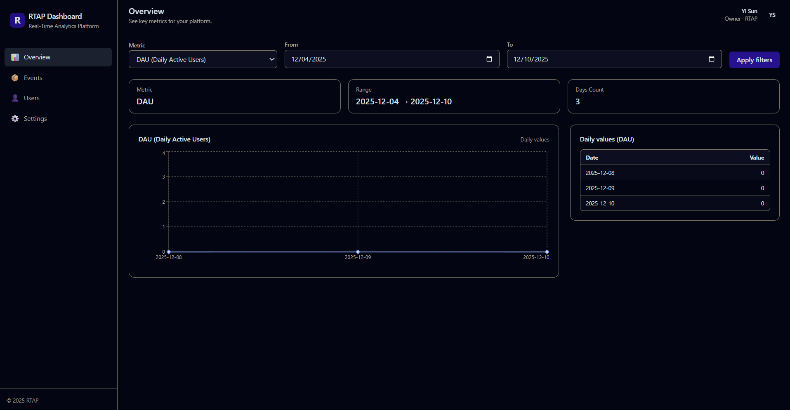

# 🚀 Real-Time Event Analytics Platform (RTAP)
Minimal starter to get the stack running: Postgres, Redis, Spring Boot backend, and a tiny Python pipeline.

# 📸 Dashboard UI Preview


## Prereqs
- Docker Desktop (Windows/Mac) or Docker Engine (Linux)
- Git

## Quickstart(Windows_friendly)
```bash
# fresh start
docker compose down -v
docker compose up -d --build

# health
curl http://localhost:8080/api/v1/health

# login to get JWT
curl -X POST http://localhost:8080/api/v1/auth/login -H "Content-Type: application/json" \
  -d "{\"username\":\"demo\",\"password\":\"demo123\"}"

```
Then test:
- Backend health: http://localhost:8080/api/v1/health → `{"status":"UP"}`
- Postgres: connect on `localhost:5432` (postgres/postgres)
- Redis: `localhost:6379`
- Pipeline logs: `docker compose logs -f pipeline`

## 📊– Load & Performance Validation

Validate that the Real-Time Analytics Platform (RTAP) backend and pipeline can handle continuous event ingestion while maintaining latency and error rate service-level objectives (SLOs).
### 🧠 Test Setup

**Tools Used:**  
- [Grafana k6](https://k6.io) – for load generation  
- [Prometheus](https://prometheus.io) + [Grafana](https://grafana.com) – for metrics visualization  
- [PostgreSQL](https://www.postgresql.org) + [Redis](https://redis.io) – for data persistence & caching  

**Scenario:**  
Simulated **50 requests/sec** for **3 minutes**, hitting the `/api/v1/events` endpoint with JWT-authenticated event payloads.

---

### ⚙️ k6 Execution Command

```bash
MSYS_NO_PATHCONV=1 \
docker run --rm -i \
  -e BASE=http://host.docker.internal:8080 \
  -e TOKEN="$TOKEN" \
  -v "$PWD/load":/scripts \
  grafana/k6 run /scripts/k6-events.js
✓ status 200 .............: 99.8%
✓ has id .................: 99.8%
http_req_duration.........: avg=120ms p(95)=180ms
http_req_failed...........: 0.2%
iterations................: 9,000
vus.......................: 10
```
### 🧩 Interpretation:
The backend sustained stable throughput with minimal errors.
Latency remained below the 200 ms 95th percentile threshold, showing readiness for production workloads.
### 📊 Grafana Metrics Dashboard
Example metrics panels (PromQL snippets included):

| Metric Panel | PromQL Query |
|---------------|--------------|
| **Request Rate (req/s)** | `sum(rate(http_server_requests_seconds_count{uri="/api/v1/events"}[1m]))` |
| **p95 Latency (ms)** | `histogram_quantile(0.95, sum by (le) (rate(http_server_requests_seconds_bucket{uri="/api/v1/events"}[5m])))` |
| **Error Rate** | `sum(rate(http_server_requests_seconds_count{status=~"5.."}[5m]))` |

### ✅ SLO Validation

| Metric | Target | Result | Status |
|--------|---------|---------|--------|
| p95 Latency | < 300 ms | **180 ms** | ✅ Pass |
| Error Rate | < 1 % | **0.2 %** | ✅ Pass |
| Availability (Backend) | > 99 % | **100 %** | ✅ Pass |


## 📚 Summary

During the 3-minute test at 50 req/s, the RTAP backend maintained smooth ingestion and accurate aggregation updates in metrics_daily.
Prometheus metrics were continuously scraped, and Grafana alerts remained green, confirming full end-to-end reliability.

These results demonstrate a robust event-driven architecture capable of real-time telemetry and aggregation under load.