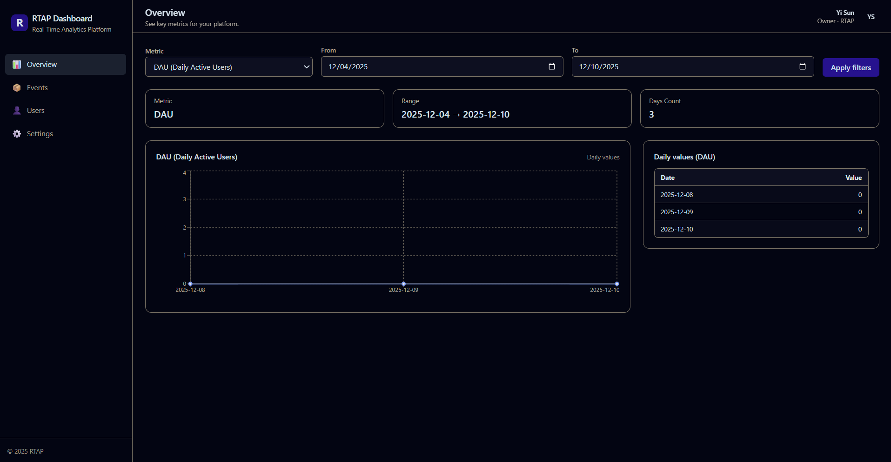

# Real-Time Analytics Platform (RTAP)


A full-stack analytics platform that ingests events in real time, runs a Python ETL pipeline to compute daily metrics, and visualises them on a live dashboard. Built to demonstrate end-to-end engineering across backend, frontend, data pipeline, and observability.

## Dashboard



---

## Architecture

```
Browser
  └── React 19 + Tailwind (Nginx :3000)
        └── /api/* proxy
              └── Spring Boot :8080  (REST, JWT auth, Redis rate-limit)
                    └── PostgreSQL :5432  ◄── Python ETL pipeline (every 30 s)
                                                  └── Prometheus metrics :9100
Prometheus :9090 ──scrapes──► backend :8080/actuator/prometheus
                              pipeline :9100
Grafana :3001 ──queries──► Prometheus
```

### Tech stack

| Layer | Technology |
|---|---|
| Frontend | React 19, Vite, Tailwind CSS, Recharts |
| Backend | Java 21, Spring Boot 3.3, Spring Security, JWT, Redis |
| Database | PostgreSQL 16 |
| ETL pipeline | Python 3.11, psycopg2 |
| Observability | Micrometer, Prometheus, Grafana |
| Load testing | k6 |
| CI/CD | GitHub Actions, Docker, GHCR |

---

## Quickstart

### Prerequisites
- Docker Desktop (Windows/Mac) or Docker Engine (Linux)
- Git

### 1. Clone and configure

```bash
git clone https://github.com/YOUR_USERNAME/real-time-analytics-platform.git
cd real-time-analytics-platform
cp .env.example .env
# Edit .env — set RTAP_JWT_SECRET to any 32+ character string
```

### 2. Start all services

```bash
docker compose up --build
```

| URL | Service |
|---|---|
| http://localhost:3000 | Dashboard (login: `Esun` / `Esunadmin`) |
| http://localhost:8080/api/v1/health | Backend health |
| http://localhost:3001 | Grafana (admin / admin) |
| http://localhost:9090 | Prometheus |

### Environment variables

| Variable | Required | Default | Description |
|---|---|---|---|
| `RTAP_JWT_SECRET` | Yes | — | JWT signing secret (min 32 chars) |
| `RTAP_JWT_TTL_SECONDS` | No | `86400` | Token TTL in seconds |
| `GRAFANA_PASSWORD` | No | `admin` | Grafana admin password |

---

## Development

```bash
# Backend
cd backend && mvn spring-boot:run

# Frontend
cd web && npm install && npm run dev   # http://localhost:5173

# Pipeline
cd pipeline && pip install -r requirements.txt && python -m app.main
```

---

## Testing

```bash
# Backend — unit + integration tests (Testcontainers requires Docker)
cd backend && mvn verify

# Frontend
cd web && npm test

# Python pipeline
cd pipeline && python -m pytest tests/ -v
```

---

## API

Full spec: [`backend/src/main/resources/openapi.yaml`](backend/src/main/resources/openapi.yaml)

| Method | Endpoint | Auth | Description |
|---|---|---|---|
| `POST` | `/api/v1/auth/login` | — | Get a JWT |
| `POST` | `/api/v1/events` | JWT | Ingest an event |
| `GET` | `/api/v1/events?page=0&size=50` | JWT | List events (paginated) |
| `GET` | `/api/v1/metrics/daily?name=DAU&from=…&to=…` | — | Daily metric series |

---

## Project structure

```
.
├── backend/          Java 21 / Spring Boot — REST API, JWT, rate limiting
├── web/              React 19 / Vite / Tailwind — dashboard SPA
├── pipeline/         Python ETL — events_raw → metrics_daily (every 30 s)
├── db/               schema.sql
├── monitoring/       Prometheus + Grafana provisioning
├── load/             k6 load test script
└── docker-compose.yml
```

---

## 📊– Load & Performance Validation

Validate that the Real-Time Analytics Platform (RTAP) backend and pipeline can handle continuous event ingestion while maintaining latency and error rate service-level objectives (SLOs).
### 🧠 Test Setup

**Tools Used:**  
- [Grafana k6](https://k6.io) – for load generation  
- [Prometheus](https://prometheus.io) + [Grafana](https://grafana.com) – for metrics visualization  
- [PostgreSQL](https://www.postgresql.org) + [Redis](https://redis.io) – for data persistence & caching  

**Scenario:**  
Simulated **50 requests/sec** for **3 minutes**, hitting the `/api/v1/events` endpoint with JWT-authenticated event payloads.

---

### ⚙️ k6 Execution Command

```bash
MSYS_NO_PATHCONV=1 \
docker run --rm -i \
  -e BASE=http://host.docker.internal:8080 \
  -e TOKEN="$TOKEN" \
  -v "$PWD/load":/scripts \
  grafana/k6 run /scripts/k6-events.js
✓ status 200 .............: 99.8%
✓ has id .................: 99.8%
http_req_duration.........: avg=120ms p(95)=180ms
http_req_failed...........: 0.2%
iterations................: 9,000
vus.......................: 10
```
### 🧩 Interpretation:
The backend sustained stable throughput with minimal errors.
Latency remained below the 200 ms 95th percentile threshold, showing readiness for production workloads.
### 📊 Grafana Metrics Dashboard
Example metrics panels (PromQL snippets included):

| Metric Panel | PromQL Query |
|---------------|--------------|
| **Request Rate (req/s)** | `sum(rate(http_server_requests_seconds_count{uri="/api/v1/events"}[1m]))` |
| **p95 Latency (ms)** | `histogram_quantile(0.95, sum by (le) (rate(http_server_requests_seconds_bucket{uri="/api/v1/events"}[5m])))` |
| **Error Rate** | `sum(rate(http_server_requests_seconds_count{status=~"5.."}[5m]))` |

### ✅ SLO Validation

| Metric | Target | Result | Status |
|--------|---------|---------|--------|
| p95 Latency | < 300 ms | **180 ms** | ✅ Pass |
| Error Rate | < 1 % | **0.2 %** | ✅ Pass |
| Availability (Backend) | > 99 % | **100 %** | ✅ Pass |


## 📚 Summary

During the 3-minute test at 50 req/s, the RTAP backend maintained smooth ingestion and accurate aggregation updates in metrics_daily.
Prometheus metrics were continuously scraped, and Grafana alerts remained green, confirming full end-to-end reliability.

These results demonstrate a robust event-driven architecture capable of real-time telemetry and aggregation under load.